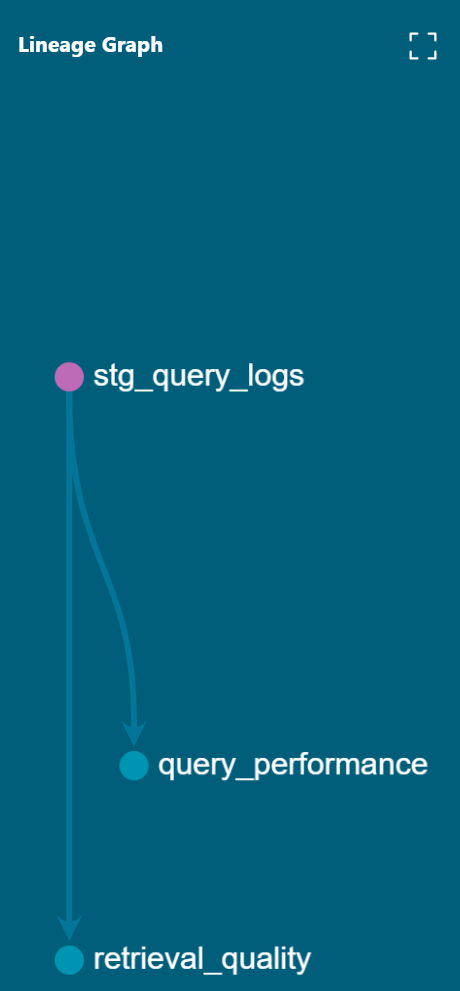

# RAG Pipeline — Data Engineering for AI

A production-grade data pipeline that ingests ArXiv AI research papers, 
stores them in a vector database, and serves answers via a RAG API — 
with full orchestration, data quality, and observability.

## Architecture

ArXiv API → Airflow DAG → PDF Extraction → Chunking → Qdrant (Vector DB)
↓
Great Expectations (Data Quality)
↓
FastAPI (RAG Endpoint) → Groq LLM
↓
DuckDB + dbt (Analytics Layer)

## Tech Stack

| Layer | Tool | Purpose |
|---|---|---|
| Orchestration | Apache Airflow | Daily pipeline scheduling |
| Vector DB | Qdrant | Storing and searching embeddings |
| Embeddings | sentence-transformers | all-MiniLM-L6-v2 (384-dim) |
| LLM | Groq (Llama 3.1) | Answer generation |
| Serving | FastAPI | RAG API endpoint |
| Analytics | dbt + DuckDB | Query performance metrics |
| Data Quality | Custom validation | Chunk quality gates |
| Containerization | Docker + Compose | Local infrastructure |

## Project Structure

rag-pipeline-de/
├── serving/
│   ├── api.py              # FastAPI RAG endpoint
│   ├── retriever.py        # Qdrant vector search
│   └── logger_db.py        # Query logging to DuckDB
├── orchestration/
│   ├── dags/
│   │   └── arxiv_ingestion_dag.py   # Airflow DAG
│   └── docker-compose.yml           # Airflow + Postgres
└── analytics/
└── rag_analytics/
└── models/
├── staging/
│   └── stg_query_logs.sql
└── marts/
├── query_performance.sql
└── retrieval_quality.sql


## Quick Start

### Prerequisites
- Docker Desktop running
- Python 3.10+
- Groq API key (free at console.groq.com)

### 1. Clone and setup

```bash
git clone https://github.com/YOUR_USERNAME/rag-pipeline-de.git
cd rag-pipeline-de
python -m venv venv
venv\Scripts\activate
pip install -r requirements.txt
```

### 2. Environment variables

Create `.env` in project root:

GROQ_API_KEY=your_key_here
QDRANT_HOST=localhost
QDRANT_PORT=6333

### 3. Start infrastructure

```bash
# Start Qdrant
docker run -d --name qdrant -p 6333:6333 -v qdrant_storage:/qdrant/storage qdrant/qdrant

# Start Airflow
cd orchestration
docker-compose up -d
```

### 4. Start the API

```bash
cd serving
uvicorn api:app --reload --port 8000
```

### 5. Query the RAG system

Open `http://localhost:8000/docs` and try:

```json
POST /query
{
  "question": "What is retrieval augmented generation?",
  "top_k": 8
}
```

### 6. Run the Airflow pipeline

Open `http://localhost:8080` (admin/admin) → unpause `arxiv_ingestion_pipeline` → trigger manually.

### 7. Run dbt analytics

```bash
cd analytics/rag_analytics
dbt run
dbt test
dbt docs serve
```

## Key Design Decisions

**Why Qdrant over Pinecone?**
Qdrant is open-source and runs locally via Docker — no cloud account needed for development. The same code deploys to Qdrant Cloud in production by changing one environment variable.

**Why DuckDB over Postgres for analytics?**
DuckDB is embedded — no server needed. It's column-oriented so analytical queries are fast. In production this swaps to Snowflake or BigQuery by changing one line in dbt profiles.yml.

**Why chunk size 500 with 50 overlap?**
500 characters is large enough to hold a complete idea but small enough to embed one specific concept. 50-character overlap prevents ideas from being cut at chunk boundaries.

**Why top_k=8 not 5?**
Testing showed that with 10 papers, definitional chunks were often ranked 6th-8th. top_k=5 missed them. top_k=8 captures them without adding too much noise.

## What I learned building this

- High retrieval scores don't guarantee good answers — chunk content quality matters as much as similarity scores
- The LLM sometimes cites papers outside the retrieved context (context leakage) — a known RAG failure mode
- DuckDB path resolution differs between notebook and FastAPI contexts — always use absolute paths in production
- Airflow's TaskFlow API makes dependencies implicit through return values — cleaner than explicit >> operators

## API Endpoints

| Endpoint | Method | Description |
|---|---|---|
| `/health` | GET | Service health check |
| `/query` | POST | RAG query — returns answer + sources + latency |

## Analytics Models

| Model | Type | Description |
|---|---|---|
| `stg_query_logs` | View | Cleaned query logs with quality buckets |
| `query_performance` | Table | Daily latency and retrieval metrics |
| `retrieval_quality` | Table | Query breakdown by quality bucket |

## Sample Output

```json
{
  "question": "What is retrieval augmented generation?",
  "answer": "RAG is a paradigm that grounds generation on 
             information retrieved from external knowledge bases...",
  "sources": [
    {
      "source": "FAIR-RAG: Faithful Adaptive Iterative Refinement...",
      "score": 0.7129,
      "published": "2025-10-25",
      "url": "http://arxiv.org/abs/2510.22344v1"
    }
  ],
  "latency_ms": 829.48
}
```

## Lineage Graph


## Roadmap

- [ ] Prometheus + Grafana monitoring dashboard
- [ ] OpenLineage data lineage tracking  
- [ ] Streamlit chat UI
- [ ] Kafka streaming ingestion
- [ ] Reranker model for better retrieval

