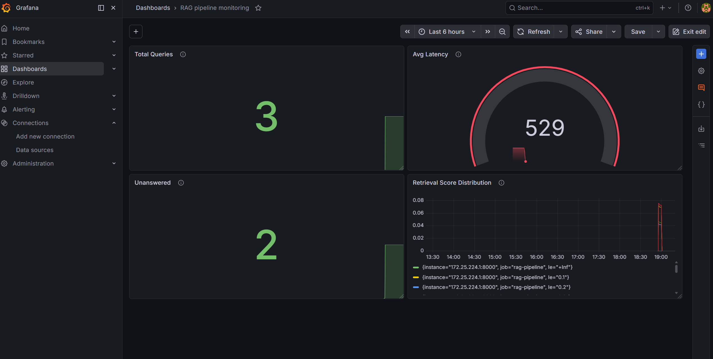

# RAG Pipeline — Data Engineering for AI

A production-grade data pipeline that ingests ArXiv AI research papers, 
stores them in a vector database, and serves answers via a RAG API — 
with full orchestration, data quality, and observability.

## Architecture

ArXiv API → Airflow DAG → PDF Extraction → Chunking → Qdrant (Vector DB)
↓
Great Expectations (Data Quality)
↓
FastAPI (RAG Endpoint) → Groq LLM
↓
DuckDB + dbt (Analytics Layer)
↓
Prometheus + Grafana (Monitoring)

## Tech Stack

| Layer | Tool | Purpose |
|---|---|---|
| Orchestration | Apache Airflow | Daily pipeline scheduling |
| Vector DB | Qdrant | Storing and searching embeddings |
| Embeddings | sentence-transformers | all-MiniLM-L6-v2 (384-dim) |
| LLM | Groq (Llama 3.1) | Answer generation |
| Serving | FastAPI | RAG API endpoint |
| Analytics | dbt + DuckDB | Query performance metrics |
| Data Quality | Custom validation | Chunk quality gates |
| Containerization | Docker + Compose | Local infrastructure |
| Monitoring | Prometheus + Grafana | Real-time metrics dashboard |

## Project Structure

rag-pipeline-de/
├── serving/
│   ├── api.py                  # FastAPI RAG endpoint
│   ├── retriever.py            # Qdrant vector search
│   ├── logger_db.py            # Query logging to DuckDB
│   └── metrics.py              # Prometheus metrics
├── orchestration/
│   ├── dags/
│   │   └── arxiv_ingestion_dag.py   # Airflow DAG
│   └── docker-compose.yml           # Airflow + Postgres
├── analytics/
│   └── rag_analytics/
│       └── models/
│           ├── staging/
│           │   ├── stg_query_logs.sql
│           │   └── schema.yml
│           └── marts/
│               ├── query_performance.sql
│               ├── retrieval_quality.sql
│               └── schema.yml
└── monitoring/
├── docker-compose.yml      # Prometheus + Grafana
└── prometheus.yml          # Scrape config


## Quick Start

### Prerequisites
- Docker Desktop running
- Python 3.10+
- Groq API key (free at console.groq.com)

### 1. Clone and setup

```bash
git clone https://github.com/WisdomWizard99/rag_pipeline.git
cd rag-pipeline-de
python -m venv venv
venv\Scripts\activate
pip install -r requirements.txt
```

### 2. Environment variables

Create `.env` in project root:

GROQ_API_KEY=**************
QDRANT_HOST=localhost
QDRANT_PORT=6333

### 3. Start infrastructure

```bash
# Start Qdrant
docker run -d --name qdrant -p 6333:6333 -v qdrant_storage:/qdrant/storage qdrant/qdrant

# Start Airflow
cd orchestration
docker-compose up -d
```
# Start Prometheus + Grafana (monitoring)
cd ../monitoring
docker-compose up -d
```

### 4. Start the API

```bash
cd serving
uvicorn api:app --reload --port 8000 --host 0.0.0.0
```

### 5. Query the RAG system

Open `http://localhost:8000/docs` and try:

```json
POST /query
{
  "question": "What is retrieval augmented generation?",
  "top_k": 8
}
```

### 6. Run the Airflow pipeline

Open `http://localhost:8080` (admin/admin) → unpause `arxiv_ingestion_pipeline` → trigger manually.

### 7. Run dbt analytics

```bash
cd analytics/rag_analytics
dbt run
dbt test
dbt docs serve
```

## Service URLs

| Service | URL | Credentials | Description |
|---|---|---|---|
| **FastAPI** | `http://localhost:8000/docs` | None | Interactive RAG API — test queries here |
| **FastAPI Health** | `http://localhost:8000/health` | None | API health check endpoint |
| **FastAPI Metrics** | `http://localhost:8000/metrics` | None | Raw Prometheus metrics endpoint |
| **Qdrant Dashboard** | `http://localhost:6333/dashboard` | None | Vector DB — view collections and vectors |
| **Airflow** | `http://localhost:8080` | admin / admin | Pipeline orchestration — trigger and monitor DAGs |
| **Prometheus** | `http://localhost:9090` | None | Metrics database — query raw time-series data |
| **Prometheus Targets** | `http://localhost:9090/targets` | None | Verify Prometheus is scraping the API |
| **Grafana** | `http://localhost:3000` | admin / admin | Live monitoring dashboard |
| **dbt Docs** | `http://localhost:8080` (dbt serve) | None | Data lineage graph and model documentation |

## Monitoring Dashboard

The Grafana dashboard at `http://localhost:3000` tracks 4 key metrics in real time:

| Panel | Query | What it shows |
|---|---|---|
| **Total Successful Queries** | `rag_queries_total{status="success"}` | Total successful RAG queries since API start |
| **Avg Query Latency (ms)** | `rate(rag_query_latency_ms_sum[5m]) / rate(rag_query_latency_ms_count[5m])` | Average end-to-end response time per query |
| **Unanswered Queries** | `rag_unanswered_total` | Queries where LLM couldn't find answer in context |
| **Retrieval Score Distribution** | `rate(rag_retrieval_score_bucket[5m])` | Qdrant similarity scores showing retrieval quality |

## Prometheus Metrics

Three metric types instrument the API:

| Metric | Type | Description |
|---|---|---|
| `rag_queries_total` | Counter | Total queries labeled by status (success/error) |
| `rag_unanswered_total` | Counter | Queries returning "I don't know" |
| `rag_query_latency_ms` | Histogram | Latency distribution across 9 buckets (100ms–5000ms) |
| `rag_retrieval_score` | Histogram | Qdrant score distribution across 10 buckets (0.1–1.0) |
| `rag_current_top_k` | Gauge | Current top_k retrieval setting |


## API Endpoints

| Endpoint | Method | Description |
|---|---|---|
| `/health` | GET | Service health check |
| `/query` | POST | RAG query — returns answer + sources + latency |

## Analytics Models

| Model | Type | Description |
|---|---|---|
| `stg_query_logs` | View | Cleaned query logs with quality buckets |
| `query_performance` | Table | Daily latency and retrieval metrics |
| `retrieval_quality` | Table | Query breakdown by quality bucket |

## Sample Output

```json
{
  "question": "What is retrieval augmented generation?",
  "answer": "RAG is a paradigm that grounds generation on 
             information retrieved from external knowledge bases...",
  "sources": [
    {
      "source": "FAIR-RAG: Faithful Adaptive Iterative Refinement...",
      "score": 0.7129,
      "published": "2025-10-25",
      "url": "http://arxiv.org/abs/2510.22344v1"
    }
  ],
  "latency_ms": 829.48
}
```

## Lineage Graph



